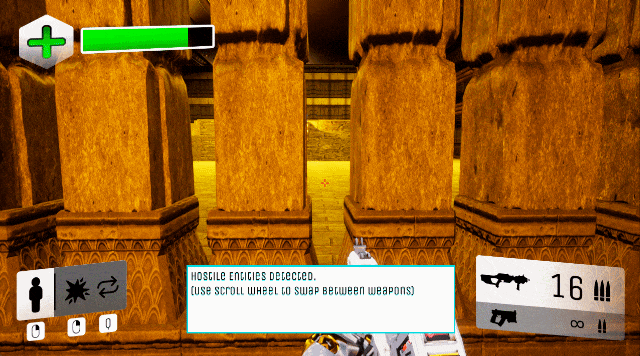
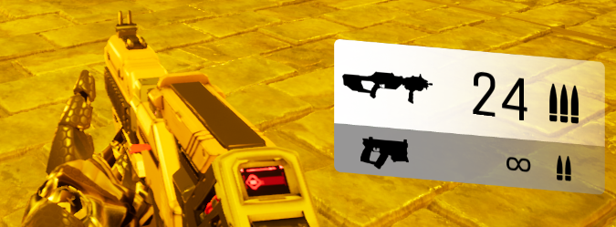
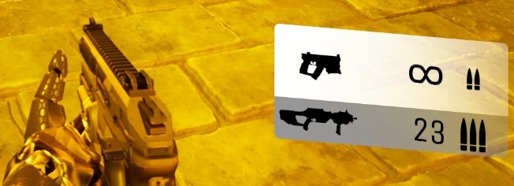
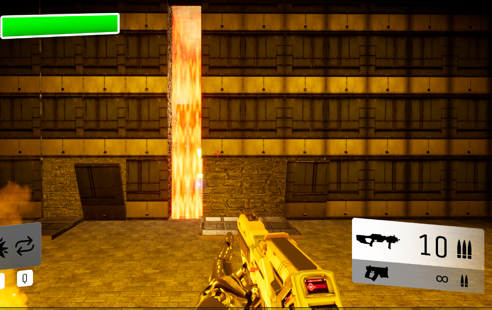
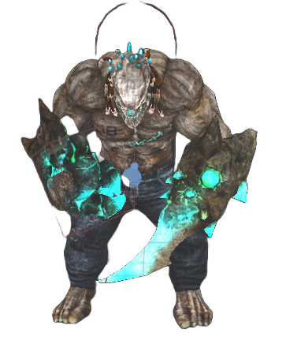
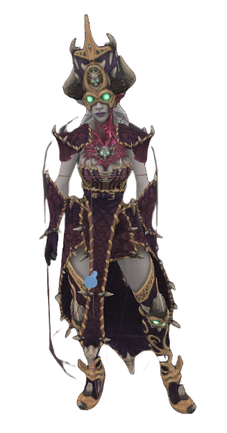
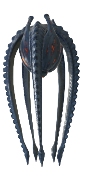
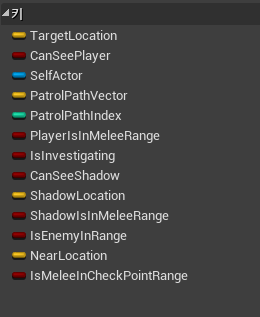
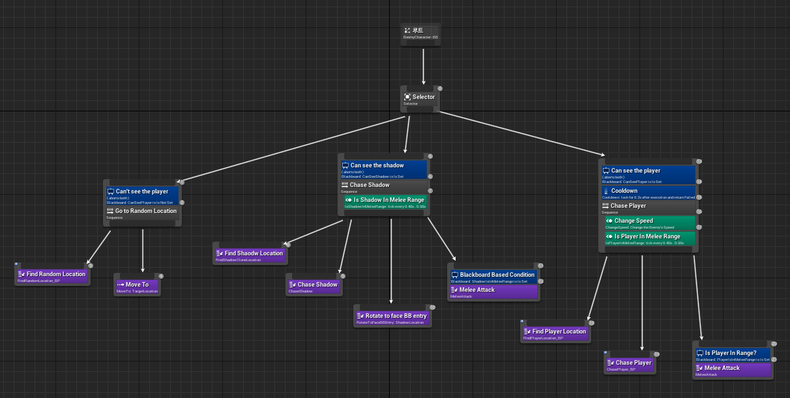

# Release from Perdition

## 목차
- [소개](#개요) 
- [주요 기능](#주요-기능) 
- [기술 스택](#기술-스택)
- [기여 및 역할](#기여-및-역할) 

## 개요
- Release from Perdition은 빠르게 진행되는 1인칭 슈팅 게임입니다. 플레이어는 밀려오는 몬스터 웨이브를 처리하며, 가로막힌 벽을 해제해  출구에 도달해야 합니다.

- **개발 기간:** 2021.08 ~ 2022.04
- **개발 인원:** 9인(Gameplay Programmer 6명, AI Programmer 1명, Designer 2명)
- **담당 역할:** 프로듀서 / AI 프로그래머

## 주요 기능

+ 그림자 기능
    + **소환**: 플레이어는 자신의 분신을 일정 거리 안에 소환시킬 수 있습니다.
    + **위치 변경**: ‘Q’키를 눌러 플레이어와 그림자의 위치를 변경할 수 있습니다.
    + **폭파**: 그림자를 소환한 후 오른쪽 마우스를 다시 누르면, 그림자가 폭하며 주위에 피해를 줍니다.

<table>
  <tr>
    <td></td>
    <td></td>
  </tr>
</table>

+ 총을 이용한 전투: 플레이어는 두 가지 총을 이용해 몬스터를 무찌를 수 있고 마우스 휠로 무기를 전환할 수 있습니다.

+ 몬스터 웨이브 & 벽: 구역마다 정해진 몬스터 웨이브가 있으며, 웨이브가 시작되면 해당 웨이브가 끝날 때까지 벽이 생성되어 통로가 가로막힙니다.

<table>
  <tr>
    <td></td>
    <td></td>
    <td></td>
  </tr>
</table>

+ 몬스터 AI: 각기 다른 공격 패턴을 가진 몬스터들이 존재하며 상황에 맞게 행동하여 플레이어를 공격합니다.

## 기술 스택
- 엔진: Unreal Engine(4.26)
- 언어: C++

## 기여 및 역할
+ 근거리 몬스터
    + 근거리 몬스터 애니메이션: 상황에 따라 공격·추적 등 애니메이션 전환 구현

    <table>
      <tr>
        <td></td>
        <td></td>
      </tr>
    </table>

    + 인지 & Behavior Tree 기반 AI: 커스텀 노드로 상태 전이와 행동 로직 제어 

+ HUD Slate Widget: UMG HUD를 Slate로 변경해 성능 향상 및 실시간 UI 갱신 구현

+ 빌드 관리 : 매주 빌드를 제작하고 최종 인스톨러를 배포하여 테스트 공유 진행
